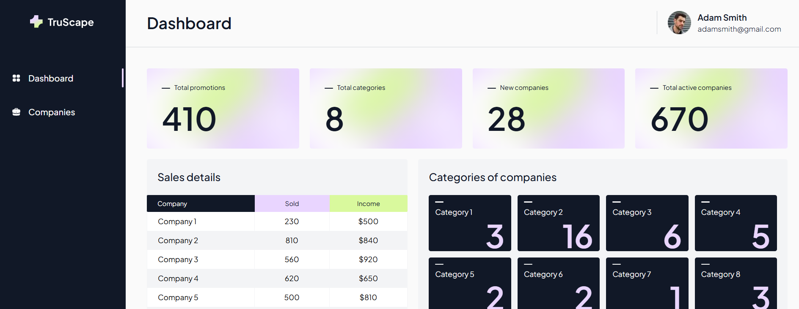
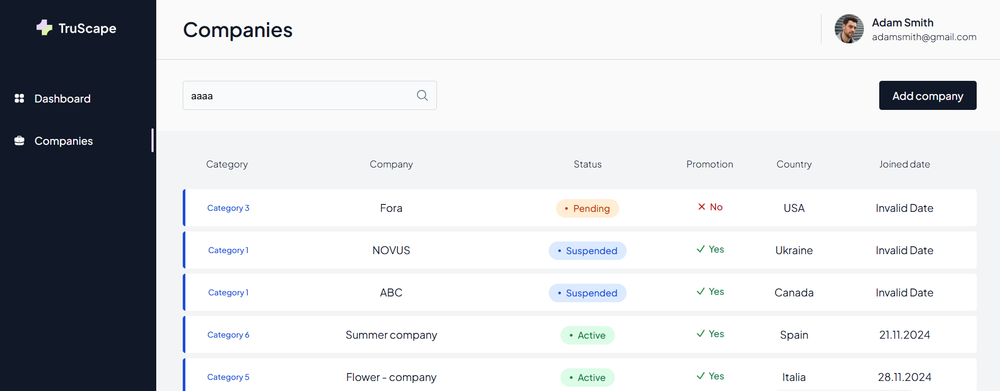

# 📌 CRM for Vendors

## 🚀 Overview

CRM for Vendors is a CRM-like web application designed to optimize vendor information management. The application includes routing and features such as adding companies and promotions.

**📊 Live Demo Dashboard: [View Dashboard](https://crm-seven-sigma.vercel.app/dashboard)**

**🏢 Live Demo Companies Page: [View Companies](https://crm-seven-sigma.vercel.app/companies)**

## 🖼️ Preview

**📊 Dashboard Page**

**🏢 Companies Page**

## 💡 Features

✅ Vendor Management: Add and view vendor companies. 
✅ Promotions: Add promotions to specific vendors. 
✅ Routing: Navigate between dashboard and companies. 
✅ State Management: React Query for efficient data fetching and caching. 
✅ Forms & Validation: Formik for handling form inputs. 
✅ Responsive Design: Styled using Tailwind CSS. 
✅ Fast Deployment: Hosted on Vercel for quick access. 

## 🛠 Technologies Used

- **Next.js** – Framework
- **React** – UI Library
- **TypeScript** – Typed JavaScript
- **Tailwind CSS** – Styling
- **clsx** – Conditional CSS classes
- **Formik** – Form Management
- **React Query** – State & Data Fetching
- **Vercel** – Deployment
- **MockAPI** – Backend Simulation

## 📦 Installation & Setup

#### Clone the repository

git clone https://github.com/your-repo/crm.git 
cd crm

#### Install dependencies

npm install

#### Run the development server

npm run dev

#### Build the project for production

npm run build

#### Start the production build

npm run start
